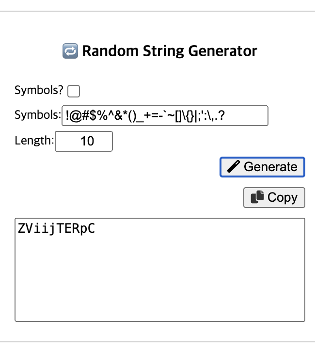

# Random String Generator

## Description (English)

This project is a simple web-based random string generator. Users can specify the length of the string and whether to include symbols. The generated string is displayed in a textarea and can be easily copied to the clipboard.

## Description (한국어)

이 프로젝트는 간단한 웹 기반 랜덤 문자열 생성기입니다. 사용자는 문자열의 길이와 특수 문자 포함 여부를 지정할 수 있습니다. 생성된 문자열은 텍스트 영역에 표시되며 클립보드에 쉽게 복사할 수 있습니다.

## Features (English)

*   Generates random strings of specified length.
*   Option to include symbols in the generated string.
*   Easy copy-to-clipboard functionality.
*   User-friendly interface.

## Features (한국어)

*   지정된 길이의 랜덤 문자열 생성.
*   생성된 문자열에 특수 문자 포함 옵션.
*   간편한 클립보드 복사 기능.
*   사용자 친화적인 인터페이스.

## Technologies Used (English)

*   HTML
*   CSS
*   JavaScript
*   Font Awesome (for icons)

## Technologies Used (한국어)

*   HTML
*   CSS
*   JavaScript
*   Font Awesome (아이콘 사용)

## How to Use (English)

1.  Clone the repository: `git clone <repository_url>`
2.  Open the `index.html` file in your web browser.
3.  Specify the desired length of the string in the "Length" input field.
4.  Check the "Symbols?" checkbox if you want to include symbols.
5.  Click the "Generate" button.
6.  Click the "Copy" button to copy the generated string to the clipboard.

## How to Use (한국어)

1.  리포지토리를 클론합니다: `git clone <repository_url>`
2.  웹 브라우저에서 `index.html` 파일을 엽니다.
3.  "Length" 입력 필드에 원하는 문자열 길이를 지정합니다.
4.  특수 문자를 포함하려면 "Symbols?" 체크박스를 선택합니다.
5.  "Generate" 버튼을 클릭합니다.
6.  "Copy" 버튼을 클릭하여 생성된 문자열을 클립보드에 복사합니다.

## Example

